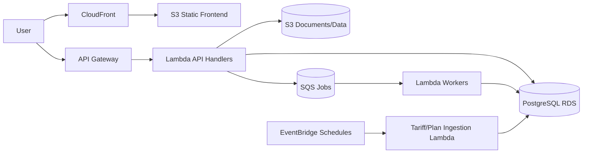

# EnergyHub Hosting Plan (Non-Container Architecture)

Date: February 9, 2026
Owner: Team Lead

## 1) Direction Change

Containerized runtime is removed from the target design.

New target:
- Frontend: static hosting (S3 + CloudFront + Route53 + ACM).
- Backend API: API Gateway + Lambda.
- Data store: PostgreSQL (RDS) for invoice, tariff, meter, and reconciliation snapshot data.
- Batch/compute: Lambda (scheduled and async) for demand and reconciliation processing.

## 2) Core Data Domains in PostgreSQL

Single PostgreSQL database with domain tables:
- `invoices`
- `invoice_line_items`
- `tariffs`
- `energy_plans`
- `meter_reads` (raw/interval)
- `meter_daily_aggregates` (derived)
- `reconciliation_runs`
- `reconciliation_line_items`
- `reconciliation_snapshots`

Cadence assumptions:
- Tariff data: low frequency (yearly/quarterly/monthly).
- Energy plan and invoice reference data: low-to-medium frequency.
- Meter data: daily updates (high volume compared to others).

## 3) Processing Model

### 3.1 Tariff + Plan ingestion (low frequency)
- Trigger: EventBridge schedules (monthly) and optional manual trigger endpoint.
- Process:
  1. Lambda fetches source data.
  2. Normalizes to internal schema.
  3. Upserts into `tariffs` and `energy_plans` with effective date windows.

### 3.2 Invoice ingestion + parse
- Trigger: user upload from frontend.
- Process:
  1. PDF stored in S3.
  2. Lambda OCR/parser extracts structured fields.
  3. Persist parsed invoice and line items into PostgreSQL.

### 3.3 Meter ingestion + daily calculation
- Trigger: daily upload/ingest (S3 event or API).
- Process:
  1. Lambda parses NEM12 interval data.
  2. Writes `meter_reads` records.
  3. Runs demand/peak/off-peak aggregation logic.
  4. Stores results in `meter_daily_aggregates`.

### 3.4 Reconciliation run (on demand)
- Trigger: user starts reconciliation from frontend.
- Process:
  1. API writes a `reconciliation_runs` job record (`PENDING`).
  2. Async Lambda task executes calculator using:
     - selected energy plan
     - applicable tariff(s)
     - meter data for billing period
     - parsed invoice data
  3. Compares calculated vs invoiced values.
  4. Persists line-level and summary result as immutable snapshot.
  5. Marks run status `COMPLETED` or `FAILED`.

Frontend behavior:
- Poll/status endpoint or websocket-style updates (phase 2).
- Show result screen from stored snapshot in DB.

## 4) AWS Services Mapping (No Containers)

- Static web: S3 + CloudFront
- DNS + TLS: Route53 + ACM
- API: API Gateway HTTP API
- Compute: Lambda (sync and async)
- Orchestration queue: SQS (for reconciliation and heavy parse tasks)
- Scheduling: EventBridge rules
- Data: RDS PostgreSQL
- Files: S3 (invoice PDFs, optional meter files, optional exports)
- Secrets/config: Secrets Manager + SSM Parameter Store
- Observability: CloudWatch Logs/Metrics/Alarms + X-Ray

## 5) Architecture Flow

## 6) API Surface (Target)

- `POST /api/invoices/upload`
- `POST /api/invoices/{id}/parse`
- `POST /api/meter/upload`
- `POST /api/reconciliation/run`
- `GET /api/reconciliation/{run_id}`
- `GET /api/reconciliation/{run_id}/snapshot`
- `POST /api/tariffs/refresh` (admin/manual)

## 7) Data Integrity and Snapshot Rules

- Reconciliation result must be persisted as immutable snapshot rows.
- Each run references explicit versions/effective-date rows for tariff and plan.
- Inputs used for a run are stored/referenced for reproducibility.
- Snapshot remains viewable even if source tariff/plan later changes.

## 8) Migration from Current Project

Current repo has ECS/container Terraform modules. Migration path:

Phase A: Introduce serverless modules
- Add Terraform modules:
  - `modules/static_web` (S3/CloudFront/ACM/Route53)
  - `modules/api_gateway`
  - `modules/lambda_api`
  - `modules/lambda_workers`
  - `modules/queues`
  - `modules/storage`
- Keep existing VPC + RDS modules and adapt security groups for Lambda-to-RDS access.

Phase B: Remove container path
- Remove ECS module from root `main.tf` once lambda API/workers are live.
- Remove frontend/backend ECR repositories and ECS deployment steps in CI/CD.

Phase C: Cutover
- Deploy frontend static bundle to S3.
- Point CloudFront/Route53 to static frontend.
- Switch API calls to API Gateway endpoint.
- Execute smoke tests and rollback plan.

## 9) CI/CD Changes

Frontend pipeline:
- Build Vite app.
- Sync `dist/` to S3.
- CloudFront invalidation.

Backend pipeline:
- Run tests.
- Package lambdas.
- Terraform plan/apply by environment.
- Publish lambda versions and aliases.

No docker image build/push required after migration.

## 10) Reliability and Cost Notes

Reliability:
- Lambda reserved concurrency for critical paths.
- Dead-letter queues for worker lambdas.
- RDS backups and PITR enabled.

Cost fit:
- For variable traffic and periodic jobs, Lambda + API Gateway typically lowers baseline cost versus always-on containers.
- RDS remains the dominant fixed cost component.

## 11) Implementation Backlog (Repo-scoped)

1. Add new Terraform modules for static web, API Gateway, Lambda, SQS, storage.
2. Add DB migration layer (Alembic) for new domain tables.
3. Refactor backend code into lambda handlers:
   - invoice parse handler
   - meter ingest handler
   - reconciliation worker
4. Add reconciliation run state machine (DB status + async worker pattern).
5. Update frontend API base URL and async status UX.
6. Delete ECS/ECR deployment path after successful cutover.

## 12) Done Criteria

Plan is considered implemented when:
- Frontend is served by CloudFront + S3.
- API is served by API Gateway + Lambda.
- All core data is persisted in PostgreSQL.
- Daily meter processing runs automatically.
- Reconciliation runs async and stores immutable snapshots.
- Container runtime (ECS/ECR) is no longer required in production path.
